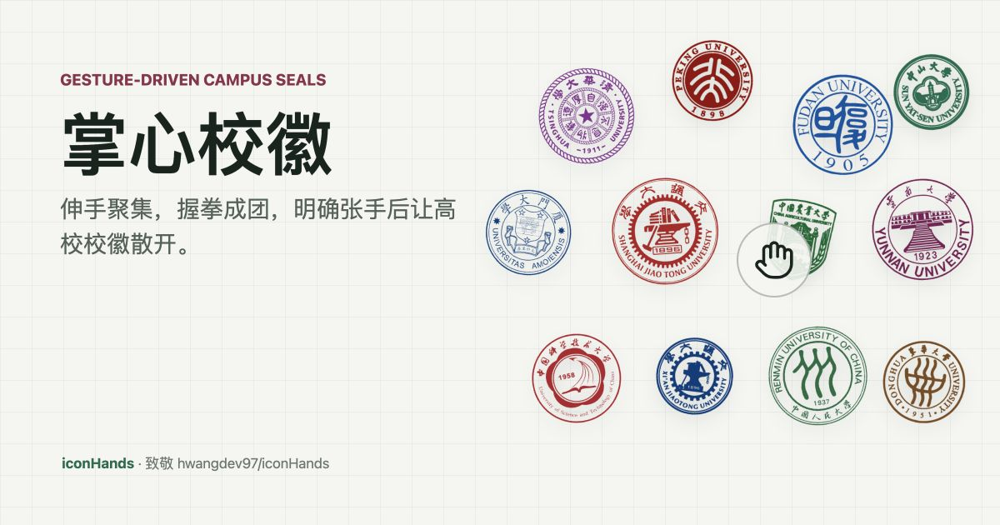

# 掌心校徽

[](https://github.com/zhouhaoyiu/iconHands/actions/workflows/ci.yml)



一个手势驱动的高校校徽互动墙。浏览器用摄像头识别手掌，校徽会跟随掌心聚集、握拳成团，并在明确张手释放时散开。

本项目 fork 并改造自 [hwangdev97/iconHands](https://github.com/hwangdev97/iconHands)，保留对原作者交互创意的致敬。

## 功能

- 掌心跟随：检测到手后，校徽根据掌心坐标移动。
- 握拳成团：握拳时校徽收紧成球。
- 张手释放：握拳后保留短暂手势记忆，连续确认张手后才散开；检测不到手不会自动炸开。
- 双手玩法：屏幕左侧的手负责吸引和释放，屏幕右侧的手负责排斥。
- 掌心轨迹：移动时显示轻微轨迹光带。
- 定格反馈：张手释放时有短暂定格和散开效果。
- 调试面板：保留摄像头预览、手部骨架、实际输入/识别帧率、手势、排斥和定格状态；手机端默认收起。
- 鼠标兜底：没有摄像头或权限被拒绝时，按住鼠标也能吸引校徽。

## 运行

```bash
npm install
npm test
npm run dev
```

打开 http://localhost:5173 并允许使用摄像头。

调试吸引点：

```text
http://localhost:5173/?attract=0.5,0.4
```

## 部署

Cloudflare Workers 静态资源部署：

```bash
npm run build
npx wrangler deploy
```

## 技术

| 部分 | 实现 |
| --- | --- |
| 手掌检测 | `@mediapipe/tasks-vision` HandLandmarker；模型同域加载，WASM/GPU 在浏览器本地推理；请求 1280x720 / 最高 60fps，并在调试面板显示硬件实际值 |
| 双手判断 | 按镜像后的屏幕 x 坐标排序；左侧手吸引，右侧手排斥 |
| 手势判断 | 指尖到手腕距离判断张开程度；握拳记忆 650ms，张手连续确认 100ms 后触发释放 |
| 物理 | `matter-js`，重力、碰撞、弹簧吸引、环绕力、排斥力 |
| 校徽 | lovefc/china_school_badge 高校校徽字体图标库，Canvas 渲染为透明贴图 |
| 配色 | 前 96 所按公开校徽主视觉整理展示色；单色字形与展示色不能替代学校官方 VI 规范 |

摄像头画面只在浏览器本地用于 MediaPipe 检测，不上传服务器。

## 第三方资源

- 高校校徽字体图标库：lovefc/china_school_badge
- 来源：https://github.com/lovefc/china_school_badge
- 许可：Apache-2.0
- 许可副本：`public/vendor/china_school_badge/LICENSE`
- 字体文件：`public/fonts/xiaohui.woff2`

- 手掌模型：Google MediaPipe Hand Landmarker float16 v1
- 来源：https://storage.googleapis.com/mediapipe-models/hand_landmarker/hand_landmarker/float16/1/hand_landmarker.task
- 许可：Apache-2.0
- 许可副本：`public/vendor/mediapipe/LICENSE`
- 模型校验：SHA-256 `fbc2a30080c3c557093b5ddfc334698132eb341044ccee322ccf8bcf3607cde1`

## 致谢

- 原项目与手势交互创意：hwangdev97/iconHands
- 物理漂浮效果参考 IconBreeze：https://github.com/yellowplushq/IconBreeze
- 高校校徽字体图标来自 lovefc/china_school_badge
